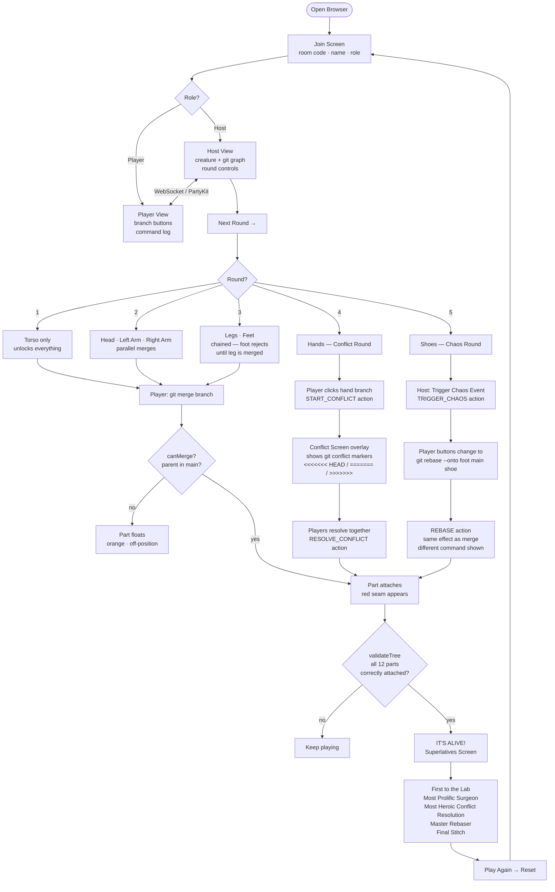
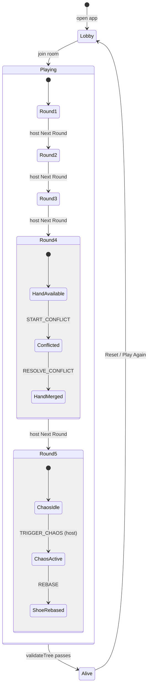
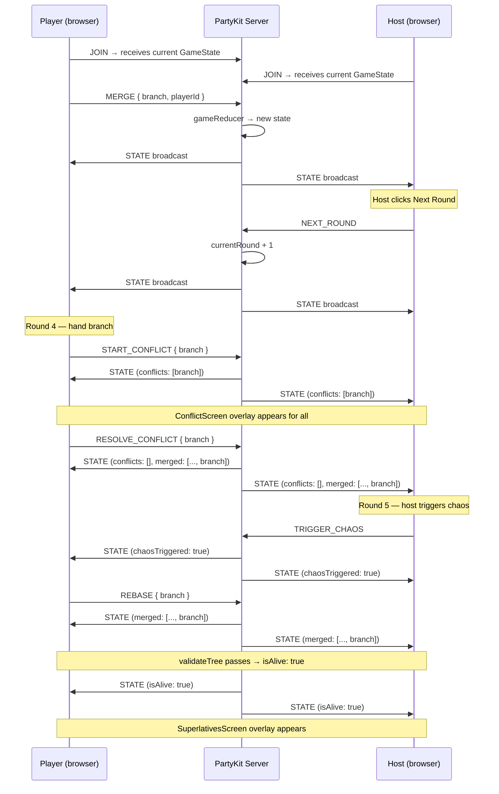
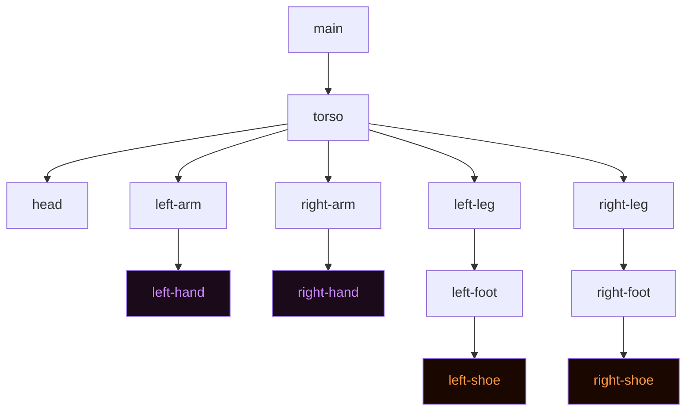

# Frankenmerge — Application Workflow

## Game Flow

```mermaid
flowchart TD
    A([Open Browser]) --> B[Join Screen\nroom code · name · role]

    B --> C{Role?}
    C -->|Host| D[Host View\ncreature + git graph\nround controls]
    C -->|Player| E[Player View\nbranch buttons\ncommand log]

    D <-->|WebSocket / PartyKit| E

    D --> F[Next Round →]
    F --> G{Round?}

    G -->|1| R1[Torso only\nunlocks everything]
    G -->|2| R2[Head · Left Arm · Right Arm\nparallel merges]
    G -->|3| R3[Legs · Feet\nchained — foot rejects\nuntil leg is merged]
    G -->|4| R4[Hands — Conflict Round]
    G -->|5| R5[Shoes — Chaos Round]

    R1 --> MERGE
    R2 --> MERGE
    R3 --> MERGE

    MERGE[Player: git merge branch] --> V{canMerge?\nparent in main?}
    V -->|yes| ATTACH[Part attaches\nred seam appears]
    V -->|no| FLOAT[Part floats\norange · off-position]

    R4 --> CONFLICT_TRIGGER[Player clicks hand branch\nSTART_CONFLICT action]
    CONFLICT_TRIGGER --> CONFLICT_SCREEN[Conflict Screen overlay\nshows git conflict markers\n&lt;&lt;&lt;&lt;&lt;&lt;&lt; HEAD / ======= / &gt;&gt;&gt;&gt;&gt;&gt;&gt;]
    CONFLICT_SCREEN --> RESOLVE[Players resolve together\nRESOLVE_CONFLICT action]
    RESOLVE --> ATTACH

    R5 --> CHAOS_BTN[Host: Trigger Chaos Event\nTRIGGER_CHAOS action]
    CHAOS_BTN --> REBASE_UI[Player buttons change to\ngit rebase --onto foot main shoe]
    REBASE_UI --> REBASE_ACTION[REBASE action\nsame effect as merge\ndifferent command shown]
    REBASE_ACTION --> ATTACH

    ATTACH --> VALIDATE{validateTree\nall 12 parts\ncorrectly attached?}
    VALIDATE -->|no| WAIT[Keep playing]
    VALIDATE -->|yes| ALIVE[IT'S ALIVE!\nSuperlatives Screen]

    ALIVE --> SUPERLATIVES[First to the Lab\nMost Prolific Surgeon\nMost Heroic Conflict Resolution\nMaster Rebaser\nFinal Stitch]
    SUPERLATIVES --> AGAIN[Play Again → Reset]
    AGAIN --> B
```

## State Machine

```mermaid
stateDiagram-v2
    [*] --> Lobby : open app
    Lobby --> Playing : join room

    state Playing {
        [*] --> Round1
        Round1 --> Round2 : host Next Round
        Round2 --> Round3 : host Next Round
        Round3 --> Round4 : host Next Round
        Round4 --> Round5 : host Next Round

        state Round4 {
            [*] --> HandAvailable
            HandAvailable --> Conflicted : START_CONFLICT
            Conflicted --> HandMerged : RESOLVE_CONFLICT
        }

        state Round5 {
            [*] --> ChaosIdle
            ChaosIdle --> ChaosActive : TRIGGER_CHAOS (host)
            ChaosActive --> ShoeRebased : REBASE
        }
    }

    Playing --> Alive : validateTree passes
    Alive --> Lobby : Reset / Play Again
```

## Data Flow

```mermaid
sequenceDiagram
    participant P as Player (browser)
    participant PK as PartyKit Server
    participant H as Host (browser)

    P->>PK: JOIN → receives current GameState
    H->>PK: JOIN → receives current GameState

    P->>PK: MERGE { branch, playerId }
    PK->>PK: gameReducer → new state
    PK->>P: STATE broadcast
    PK->>H: STATE broadcast

    Note over H: Host clicks Next Round
    H->>PK: NEXT_ROUND
    PK->>PK: currentRound + 1
    PK->>P: STATE broadcast
    PK->>H: STATE broadcast

    Note over P: Round 4 — hand branch
    P->>PK: START_CONFLICT { branch }
    PK->>P: STATE (conflicts: [branch])
    PK->>H: STATE (conflicts: [branch])
    Note over P,H: ConflictScreen overlay appears for all

    P->>PK: RESOLVE_CONFLICT { branch }
    PK->>P: STATE (conflicts: [], merged: [..., branch])
    PK->>H: STATE (conflicts: [], merged: [..., branch])

    Note over H: Round 5 — host triggers chaos
    H->>PK: TRIGGER_CHAOS
    PK->>P: STATE (chaosTriggered: true)
    PK->>H: STATE (chaosTriggered: true)

    P->>PK: REBASE { branch }
    PK->>P: STATE (merged: [..., branch])
    PK->>H: STATE (merged: [..., branch])

    Note over P,H: validateTree passes → isAlive: true
    PK->>P: STATE (isAlive: true)
    PK->>H: STATE (isAlive: true)
    Note over P,H: SuperlativesScreen overlay appears
```

## Part Dependency Tree

```mermaid
graph TD
    main --> torso
    torso --> head
    torso --> left-arm
    torso --> right-arm
    torso --> left-leg
    torso --> right-leg
    left-arm --> left-hand
    right-arm --> right-hand
    left-leg --> left-foot
    right-leg --> right-foot
    left-foot --> left-shoe
    right-foot --> right-shoe

    style left-hand fill:#1a0a1a,color:#cc88ff
    style right-hand fill:#1a0a1a,color:#cc88ff
    style left-shoe fill:#1a0800,color:#ff9844
    style right-shoe fill:#1a0800,color:#ff9844
```

> **Purple** = conflict parts (Round 4). **Orange** = rebase parts (Round 5).
